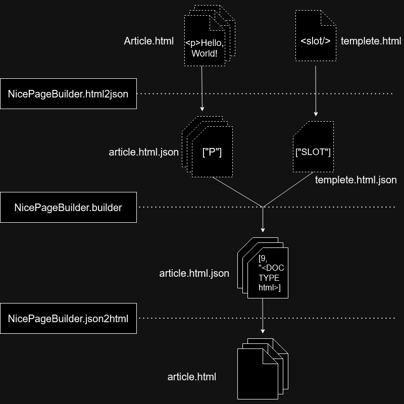

# gulp-nice-page-builder

[html.json](https://github.com/itozyun/html.json) をラップして使用する Static Site Generator. 通常 gulp プラグイン版を使う．

---

## Overview 概要

[Edit on draw.io](https://viewer.diagrams.net/?tags=%7B%7D&lightbox=1&highlight=0000ff&edit=_blank&layers=1&nav=1&title=%E5%90%8D%E7%A7%B0%E6%9C%AA%E8%A8%AD%E5%AE%9A%E3%83%95%E3%82%A1%E3%82%A4%E3%83%AB.drawio#R%3Cmxfile%3E%3Cdiagram%20name%3D%22%E3%83%9A%E3%83%BC%E3%82%B81%22%20id%3D%22hWPulbVjfiungVMZC6j8%22%3E7VvBdps4FP2WWXhZHxAg42USZ9pFO%2FY56Wmb2RFQbBKMXCzH9nz9SCDZSCgxuMZyaDeJ9ABZuvfy9PQkes7NfPMxCxazLzhCSQ9Y0abnjHoA%2BPaA%2FmWGbWEYQLcwTLM4Kkz23nAX%2F4e40eLWVRyhpXQjwTgh8UI2hjhNUUgkW5BleC3f9ogT%2BVcXwRRVDHdhkFSt3%2BOIzPiwLGtv%2F4Ti6YwoF%2BaBuJcblrMgwuuSybntOTcZxqQozTc3KGHQCViK5%2F5%2B5equXxlKSZ0Hvvnf5h%2FtOb7%2BN%2FJ%2FPkVj92kIPvBWXoJkxcfLO0u2AgDa7wUrppjQf9frWUzQ3SIImW1NKae2GZkntGbT4kMQPk8zvEqj8YokcYq4PQqy5zF9KiZMB1bf8nLjcoYifgfvCcoI2rw6RHsHHNUbwnNEsi29hT%2Fg%2BF7xyFbW0LpMXGGalTizBWcB18p01%2FIeT1rgkDaAF3QL3oEMLzANr9MteKEMr2MaXrdT8Hr%2BhakXHoY3xyoHwTqM7q9gJBym51VAAQMNKrAtUIYaUGBCmB7iF1qcsiJB80WCCOrno%2BfX6c%2BVbqlASUEhMl5BEk9TWg4pOCijBgZdTGf%2BK35hHkdR8pqsZWoecUp47AKs0%2BgVKnqFVWp22ixT47RFja0LFircXDEMk25TA9xLo6ZBoBEGWXTYmZx%2BcrNk72t8drMbRA%2BGMBsomLnGMWsQEhjCzFcw84xj5tVxm8Fv4DYdS3abA40PsL2z%2Bs0aMZhZPXuqns37gGqI9k8cokkwRderOIlQlosYPC1x%2Bo41KyLiQRVvbUTcmkbFOqVBSNwvsO%2BmF4GO%2FEY4mjfivF4EmM2inQBTdyhjCjWqP3PmrEFEe6GYKp4b%2BsYxNZsvOwWmSkQMh8YxrRERnzuL42iUdt4sDqgV86phw0Pxv3MTl6BlWDO51t5EdYEpR2gZF%2BvgGLGyEAt0crUmiLGNy9WvP1%2FVW521MAW55kMlXc7cOExK9OMaj36ETC8LJiXwdo0HNI42yx%2FM2dhzP7dMMGE%2FIYyX4O7a3ivUJPh1rLTmCR3daqhMykKm4xNtE%2FfAjZibHjKJHfhzxU6d5DB%2BWOY4XtEbbH%2BxyfET18Vk9h1nSfSXOY5tv5UdCZnjmg6qPY5rrCRQGl2xM009tkBjqy0ZFSUPOQkIZSHNLcBy2LtLMvy8O8cEKpijTUx%2B8BZY%2BZ7Z%2Bx6vjTal20ZbXik6iaLKMSqFCDoQvMpC9AYERWqxyliJEl1iR9gylAQkfpH7oeOJ%2F8IEx7SHe0F4ii%2F2FKqL%2FvOn9mxXGhooc58tvIloiATZFJFKQ7lsdsP%2BBSXpVl8HlVQSjyKKlHbnx14JrHovRMIqe13ktW25NkFZTMfDnEFDtRQgvaUW16RaPKCoxT5SLa6lNKRO7W2rpcaisAtqgX%2FUcgq11FiTldQSJsFyGYdvCaYux%2B%2BeukpDakajbepqrBPfc4BhSiBAORbrWsO%2Bd5xEBv7BploWidhM%2ByOSdkUCwclEommqbZHUOglYPtLS6R3p3XcG4oyGrzkPeNYdaVebL%2FhtCXIUgjxgnKAaW7EdC6PsnZcSLAxPFEjBMwdSbrNMTQfIc4ZDCXFbfTGOXb7svsI4F3XNUiMdoA4CV3nvjiYPAuULGrWhtsnTZCq8Urr67vP4ayl57Y3MzVytZKwrZ0E1ccZZU9auZue8TMjkQthoZY%2BoctLcOBua1Ix3Pcy3gSxpU6e0cTQaN90kgq9sEn29n9yyoRZHIsp7g42oT9AjOd1rCNt4DWtEk%2FA0xNPq%2FgPxwo3uP7J3bv8H%3C%2Fdiagram%3E%3C%2Fmxfile%3E)

1. Generate HTML from template
2. Separate common data shared by multiple pages into external files
3. Site developers can freely add and call functions that return HTML strings
4. Rewrite pages or add new pages based on aggregation of pages
5. Rewrite pages or add new pages based on JSON files

---

1. テンプレートから完全な HTML 文書を生成します
2. 複数ページで共通するデータを JSON ファイルに分離する(Mixin)
3. [html.json](https://github.com/itozyun/html.json) をラップしています
   1. nicePageBuilder.html2json
      * *.html ファイルを *.html.json ファイルに変換する
        * メタ情報を `Array` の先頭に追加した HTMLJsonWithMetadata 形式の .json ファイルです
      * 参照されているテンプレートと Mixin をまとめたファイルを作成する
   2. nicePageBuilder.json2json
      * 動的ページのリストを出力する
      * `<? ?>` と動的属性(`<a :href="">`) を置き換える
      * `onEnterNode(currentVNode)` で VDOM を使った文書ツリーの変更ができる
      * `onDocumentReady(rootVNode)` で VDOM を使った文書ツリーの変更ができる
   3. nicePageBuilder.builder
      * 参照する Mixin とテンプレートのメタ情報をページのメタ情報にコピーする
      * *.html.json をテンプレートに埋め込んで完全な html.json 文書にする
   4. nicePageBuilder.json2html
      * *.html.json(HTMLJsonWithMetadata 形式) を *.html に変換する
      * `<? ?>` と動的属性(`<a :href="">`) を置き換える
      * `onEnterNode(currentVNode)` で VDOM を使った文書ツリーの変更ができる
   5. nicePageBuilder.json2html.stream
      * Streaming SSR

## Install

~~~sh
npm install gulp-nice-page-builder
git submodule update --init --force --recursive --depth=2
git submodule foreach git pull origin master
~~~

## Build and test

~~~sh
gulp dist
gulp tutorial
npm run test
~~~

## gulp plugin の使用例

~~~js
gulp.task('html', function(){
    const nicePageBuilder = require('gulp-nice-page-builder').gulp({srcRootPath: 'src', urlOrigin: '//example.com/'});

    return gulp.src(
                   ['./src/**/*.html', './src/**/*.htm', './src/**/*.php', './src/**/*.json']
              ).pipe(
                   nicePageBuilder.html2json(null, {trimWhitespaces: 'aggressive'})
              ).pipe(
                   nicePageBuilder.builder()
              ).pipe(
                   nicePageBuilder.json2html()
              ).pipe(
                   gulp.dest('./public')
              );
});
~~~

## 用語解説

| 名称            | 拡張子                    | 説明                                                                                                       |
|:----------------|:--------------------------|:-----------------------------------------------------------------------------------------------------------|
| メタ情報 *1     |                           | ページ、テンプレート内 `` または Mixin に書いておく          |
| ページ *2       | .html, .htm, .xhtml, .php | コンテンツとメタ情報だけが書かれた HTML                                                                    |
| テンプレート *3 | .html, .htm, .xhtml, .php | ページ、Mixin から参照される．必ず単一の `<slot></slot>` を持つ                                            |
| Mixin *4        | .json                     | 複数ページで共通のメタ情報を記述した json ファイル．ページ(.html), テンプレート, 他の Mixin から参照される |

1. メタ情報の各プロパティの優先度
   1. ページ
   2. ページの MIXINS\[0]
      * ページの MIXINS\[0] の MIXINS\[0] ~ MIXINS\[z] (MIXIN は入れ子にできる)
   3. ページの MIXINS\[z]
   4. テンプレート
   5. テンプレートの MIXINS\[0]
      * テンプレートの MIXINS\[0] の MIXINS\[0] ~ MIXINS\[z] (MIXIN は入れ子にできる)
   6. テンプレートの MIXINS\[z]
2. テンプレート、メタ情報、Mixin を使用しないプロジェクトも可能だが、その場合 [html.json](https://github.com/itozyun/html.json) だけで事足りる．
3. テンプレートは入れ子にできます

## メタ情報の定義積みプロパティ

| 名称        | 型               | 説明                         | ページ(.html)     | テンプレート | Mixin |
|:------------|:-----------------|:-----------------------------|:------------------|:-------------|:------|
| TEMPLETE    | `string`         | テンプレート(.html) へのパス | ✓                | ✓           | ✓    |
| MIXINS      | `Array.<string>` |                              | ✓                | ✓           | - *2  |
| URL         | `string`         | `"/contact/"`                | ✓                | -            | -     |
| CREATED_AT  | `number`         |  `file.stat.birthtimeMs`     | ✓                | -            | -     |
| MODIFIED_AT | `number`         |  `file.stat.ctimeMs`         | ✓                | -            | -     |
| UPDATED_AT  | `number`         | ページとそれが参照する Mixin 及びテンプレートの MODIFIED_AT の内の最大の値．*1 | ✓ | - | - |

1. Mixin のメタ情報がページ(.html)にコピーされなかった場合、ページ(.html)の UPDATED_AT は更新されません．

### ページの例

`src/index.html`

メタ情報は一番最初に書くことを推奨

~~~html

Hello, World!
~~~

### テンプレートの例

`src/templete.html`

`<slot>` 要素を持つファイルはテンプレートとして扱われます．テンプレートにひとつです．

`<? ?>` PROCESSING_INSTRUCTION を使う場合、コードハイライトの効く .php などの適当なファイル拡張子にするのが良い、その場合 `gulp.src()` に `"src/**/*.php"` を加えること．

~~~html
<!DOCTYPE html>

<html>
<body>
<main>
     <slot></slot>
</main>
~~~

## html.json と nice-page-builder の .json データの比較

### html.json のドキュメント

先頭が数値(9: DOCUMENT または 11: DOCUMENT_FRAGMENT)で始まります．

~~~json
[9, "<!DOCTYPE html>", ["HTML"]]
~~~

### nice-page-builder のメタ情報付き html.json のドキュメント

先頭にメタ情報 `{}` のある配列です．nicePageBuilder.builder() を通すとテンプレートが適用されます．

~~~json
[{"URL":"/contact/"}, 9, "<!DOCTYPE html>", ["HTML"]]
~~~

## Links

* [github](https://github.com/itozyun/gulp-nice-page-builder)
* [npm](https://www.npmjs.com/package/gulp-nice-page-builder)
* [html.json](https://github.com/itozyun/html.json)

## History

0.4.x までは html.json を使っていませんでした．

0.1.x までは Visual Studio Code エクステンションでした．[Visual Studio Marketplace > Nice Page Builder](https://marketplace.visualstudio.com/items?itemName=itozyun.nice-page-builder)

**Enjoy!**

## License

[gulp-nice-page-builder](https://github.com/itozyun/gulp-nice-page-builder) is licensed under MIT license.

(C) 2024 [itozyun](https://github.com/itozyun)([blog](//outcloud.blogspot.com/))