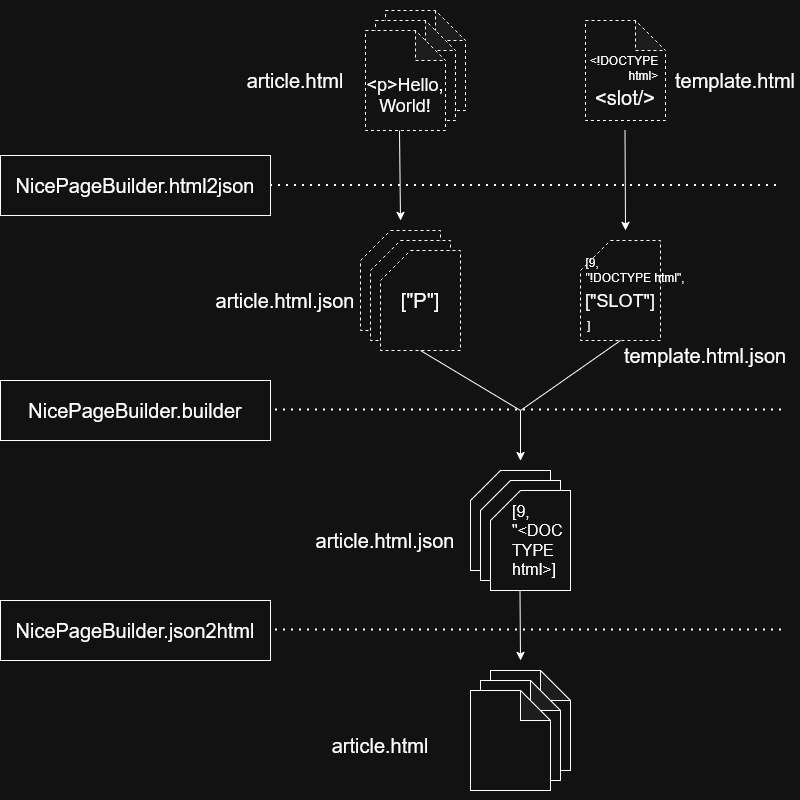

# gulp-nice-page-builder

[html.json](https://github.com/itozyun/html.json) をラップして使用する Static Site Generator. 通常 gulp プラグイン版を使う．

Streaming SSR が可能です．

---

## Overview 概要

[Edit on draw.io](https://viewer.diagrams.net/?tags=%7B%7D&lightbox=1&highlight=0000ff&edit=_blank&layers=1&nav=1&dark=auto#R%3Cmxfile%3E%3Cdiagram%20name%3D%22%E3%83%9A%E3%83%BC%E3%82%B81%22%20id%3D%22hWPulbVjfiungVMZC6j8%22%3E7Vxde6I4FP4tc%2BHl%2BED4EC9b7XYuZqc%2B2%2Fnq3FFIlRbBYqy6v34TIEJCrGANsWyvhEMI5H3fnJycBHvGaL65TtzF7O%2FYh2EPaP6mZ4x7AOiao%2BMfYtlmlsEgN0yTwM8LFYbb4F9I78ytq8CHS6YgiuMQBQvW6MVRBD3E2NwkiddssYc4ZJ%2B6cKewYrj13LBq%2FRX4aJZZHU0r7F9gMJ0h7sLcpWVzw3Lm%2BvG6ZDKuesYoiWOUHc03IxgS7Cgs2X1%2F7bm6e68ERqjODT%2Bdn%2FNrfR5f%2FvGd50f%2Fxnwcgs95LS9uuMrbm78s2lIA8HsvyGEUI%2FxzuZ4FCN4uXI%2FY1phzbJuheYjPdHx473pP0yReRf7NCoVBBHO77yZPN%2FiuABEdaH3NSo3LGfTzEtX20JeDCYKbkilv3zWM5xAlW1wkv2o4VnbLltXQukxcZpqVONMpZ26ulemu5gJPfJBD2gBe0C14Byy8QDW8RrfgtVl4DdXwmp2C13LOTL32YXhTrFIQtMPovgUj6jAtqwIKGAhQsWWBMhSAYoeI6CF4wYdTcojgfBG6CPbT1ufX8eNKRSpQYgQQi5cbBtMIH3sYL5hgA8EpwCP%2FRX5hHvh%2BuE%2FWLDUPcYTy2AVop9GrzenVrlKz02aZGkMWNbooWKhw4xIMw25TA8xzo6ZBoOG5iX%2FYmZx%2BcNNY76t8dNMbRA%2BKMBtwmJnKMWsQEijCzOEws5RjZn24Ter%2BWLc5EPgA3WrVb9aIwdTq2eL1rN4HVEO0b4EHJ%2B4UXq6C0IdJKmLwuIyjd6xZGhEPqngLI2JpGqXzlAYhcT%2FDvptexDbYHmEIekS7XgSozaKdAFNzyGJqC1TfcuasQUR7pphyntt2lGOqNl92Cky5iNgeKse0RkTcdhbHECit3SwOqBXz8mHDffbbuYGL0jKsmVyTN1CdYcrR1pSLdXCMWEmIBTo5W6PE6Mrl6tQfr%2BrNziQMQab6UEmUM1cOExf9mMqjHyrT84KJC7xN5QGNIczyu3PS9tTPLcMYkUdQ4zm4O9lrhQ6oxYo0T2iIZkNlUhYsHV9wnXEPjOjYdJ8w7NjPK7LrJIXx8zLF8QIX0J3FJsWPXqeD2a84Cf1P6jjWHSkrEhzH9XqePI5rzCRg5F%2BQPU09MkEjsy0WFS4POXERZiFKLUAzSN9FSfy028cEKpjDTYB%2B5zWQ4zti71v52XhTKjbe5id7qVjGq8SDr7SYZhKhz2zBqjJWokSU2KG2BIYuCl4g8xYinvInTOIAv3IhCIvzxRZHddag%2FK6C7UpFA27s06k3oRUhN5lCVKkolc2u2W9Qkmj2dVBJJfFwoojw6%2FwulEBO76hIyEmhi%2FRsWz6bwCTA7SHO4HW1ZJi8phbzrNRiAU4t%2BpFqMTWuIn5ol62WGpPCd6gW%2B0MtUtRSY05WUosXustl4L0mmL0cd426SkV8RkM2dTXmie8qwDgTgQBuW6ypDfvWcRIZOAerkiwSupj2IRK5IrHByUQiqEq2SBrvBOz0ivTuOwO6R8MR7AdsdUXaFOYL%2FrcEGRxBFlBOUI2l2I6FUfrOS1EWhicKpOyWAymzWaamA%2BQZwyGDuM53jGOnL7uvMNqirllqpAPU2cDk%2Bt3R5NmA%2B4KGr0g2eYJMhVVKV99%2BvfleSl5bY3Ujl5SMdWUvqCDOaDVlbQpWzsuETM6EDSlrRJWd5srZEKRmrMthugykMYs6pYWj8U3TRSJ7zyLR97vJFWlqtiWivDbYiPoQPqDTdUNbRjesEU3akohf%2FeOsfzyt%2FngWmv5Yzr5%2Be3yOhB9xlzn%2BhEnO2CmIpqF9aVKgUQoKbpP07StUCzg%2Bs5mDDsTEV1gWaGE%2F8TYbBVlGhXddb5P4A7M8AaFp76rwuXMT%2B%2FTB00orKJRF%2B%2F2u5lHXyK98WCSYQ7bKvmgKeRz74zd339N6bTn8cV%2FXC%2F4cgjryN9KHT4u%2F9ciC3%2BK%2FUYyr%2FwA%3D%3C%2Fdiagram%3E%3C%2Fmxfile%3E)

1. Generate HTML from template
2. Separate common data shared by multiple pages into external files
3. Site developers can freely add and call functions that return html(.json)

---

1. テンプレートとメタ情報から完全な HTML 文書を生成します
   * SSG, Streaming SSR が可能です
2. 複数ページで共通するメタ情報を JSON ファイルに分離する(Mixin)
3. [html.json](https://github.com/itozyun/html.json) をラップしています
   1. nicePageBuilder.html2json
      * *.html ファイルを *.html.json ファイルに変換する
        * メタ情報を `Array` の先頭に追加した `HTMLJsonWithMetadata` 形式の .json ファイルです
      * 参照されているテンプレートと Mixin をまとめたファイルを作成する
   2. nicePageBuilder.json2json
      * 動的ページのリストを出力する
      * `<? ?>` と動的属性(`<a :href="">`) を置き換える
      * `onEnterNode(currentVNode)` で VDOM を使った文書ツリーの変更ができる
      * `onDocumentReady(rootVNode)` で VDOM を使った文書ツリーの変更ができる
   3. nicePageBuilder.builder
      * 参照する Mixin とテンプレートのメタ情報をページのメタ情報にコピーする
      * *.html.json をテンプレートに埋め込んで完全な html.json 文書にする
   4. nicePageBuilder.json2html
      * *.html.json(`HTMLJsonWithMetadata` 形式) を *.html に変換する
      * `<? ?>` と動的属性(`<a :href="">`) を置き換える
      * `onEnterNode(currentVNode)` で VDOM を使った文書ツリーの変更ができる
   5. nicePageBuilder.builder.stream
      * Streaming SSR
   6. nicePageBuilder.json2html.stream
      * Streaming SSR
   7. nicePageBuilder.dest
      * gulp plugin only
      * json ファイルを gulp の出力に加えます
        * NicePageBuilder.DEST_TARGET.ALL_MIXINS
        * NicePageBuilder.DEST_TARGET.ALL_TEMPLATES
        * NicePageBuilder.DEST_TARGET.ALL_PAGE_METADATA
        * NicePageBuilder.DEST_TARGET.ALL_ADDITIONAL_JSONS
        * NicePageBuilder.DEST_TARGET.ALL_PAGES

## Install

~~~sh
npm install gulp-nice-page-builder
git submodule update --init --force --recursive --depth=2
git submodule foreach git pull origin main
~~~

## Build and test

~~~sh
gulp dist
gulp tutorial
npm run test
~~~

## gulp plugin の使用例

~~~js
gulp.task('html', function(){
    const nicePageBuilder = require('gulp-nice-page-builder').gulp({srcRootPath: 'src', urlOrigin: '//example.com/'});

    return gulp.src(
                   ['./src/**/*.html', './src/**/*.htm', './src/**/*.xhtml', './src/**/*.php', './src/**/*.json']
              ).pipe(
                   nicePageBuilder.html2json(null, {trimWhitespaces: 'aggressive'})
              ).pipe(
                   nicePageBuilder.builder()
              ).pipe(
                   nicePageBuilder.json2html()
              ).pipe(
                   gulp.dest('./public')
              );
});
~~~

## 用語解説

| 名称            | 拡張子                    | 説明                                                                                                       |
|:----------------|:--------------------------|:-----------------------------------------------------------------------------------------------------------|
| メタ情報 *1     |                           | ページ、テンプレート内 `` または Mixin に書いておく          |
| ページ *2       | .html, .htm, .xhtml, .php | コンテンツとメタ情報だけが書かれた HTML                                                                    |
| テンプレート    | .html, .htm, .xhtml, .php | ページ、Mixin から参照される．必ず単一の `<slot></slot>` を持つ．テンプレートは入れ子にできます．          |
| Mixin           | .json                     | 複数ページで共通のメタ情報を記述した json ファイル．ページ(.html), テンプレート, 他の Mixin から参照される |

1. メタ情報の各プロパティの優先度
   1. ページ
   2. ページの MIXINS\[0]
      * ページの MIXINS\[0] の MIXINS\[0] ~ MIXINS\[z] (MIXIN は入れ子にできる)
   3. ページの MIXINS\[z]
   4. テンプレート
   5. テンプレートの MIXINS\[0]
      * テンプレートの MIXINS\[0] の MIXINS\[0] ~ MIXINS\[z] (MIXIN は入れ子にできる)
   6. テンプレートの MIXINS\[z]
2. テンプレート、メタ情報、Mixin を使用しないプロジェクトも可能だが、その場合 [html.json](https://github.com/itozyun/html.json) だけで事足りる．

## メタ情報の定義積みプロパティ

| 名称        | 型               | 説明                         | ページ(.html)     | テンプレート | Mixin |
|:------------|:-----------------|:-----------------------------|:------------------|:-------------|:------|
| TEMPLATE    | `string`         | テンプレート(.html) へのパス | ✓                | ✓           | ✓    |
| MIXINS      | `Array.<string>` |                              | ✓                | ✓           | ✓    |
| URL         | `string`         | `"/contact/"`                | ✓                | -            | -     |
| CREATED_AT  | `number`         |  `file.stat.birthtimeMs`     | ✓                | -            | -     |
| MODIFIED_AT | `number`         |  `file.stat.ctimeMs`         | ✓                | -            | -     |
| UPDATED_AT  | `number`         | ページとそれが参照する Mixin 及びテンプレートの MODIFIED_AT の内の最大の値．*1 | ✓ | - | - |

1. Mixin のメタ情報がページ(.html)にコピーされなかった場合、ページ(.html)の UPDATED_AT は更新されません．

これ以外のプロパティは Web 開発者が任意に定義します。ページのメタ情報は `pageContext.getMetadata()`, `pageContext.getMetadataOf(path)` で取得できます。

### ページの例

`src/index.html`

メタ情報は一番最初に書くことを推奨

~~~html

Hello, World!
~~~

### テンプレートの例

`src/template.html`

`<slot>` 要素を持つファイルはテンプレートとして扱われます．テンプレートにひとつです．

`<? ?>` PROCESSING_INSTRUCTION を使う場合、コードハイライトの効く .php などの適当なファイル拡張子にするのが良い、その場合 `gulp.src()` に `"src/**/*.php"` を加えること．

~~~html
<!DOCTYPE html>

<html>
<body>
<main>
     <slot></slot>
</main>
~~~

## html.json と nice-page-builder の .json データの比較

### html.json のドキュメント

先頭が数値(9: DOCUMENT または 11: DOCUMENT_FRAGMENT)で始まります．

~~~json
[
   9, "<!DOCTYPE html>", ["html"]
]
~~~

### nice-page-builder のメタ情報付き html.json のドキュメント

先頭にメタ情報 `{}` のある配列です．`TEMPLATE` を持つので、nicePageBuilder.builder() を通すとテンプレートが適用されます．

~~~json
[
   {"URL":"/contact/", "TEMPLATE":"/base.html"},
   11, ["p", "Hello, world."]
]
~~~

## Links

* [github](https://github.com/itozyun/gulp-nice-page-builder)
* [npm](https://www.npmjs.com/package/gulp-nice-page-builder)
* [html.json](https://github.com/itozyun/html.json)
* [MemoryReadableStream](https://outcloud.blogspot.com/2025/10/memory-readable-stream.html) 「Node.js でメモリ上のデータから stream を作る」

## History

0.4.x までは html.json を使っていませんでした．

0.1.x までは Visual Studio Code エクステンションでした．[Visual Studio Marketplace > Nice Page Builder](https://marketplace.visualstudio.com/items?itemName=itozyun.nice-page-builder)

**Enjoy!**

## License

[gulp-nice-page-builder](https://github.com/itozyun/gulp-nice-page-builder) is licensed under MIT license.

(C) 2024-2025 [itozyun](https://github.com/itozyun)([blog](//outcloud.blogspot.com/))